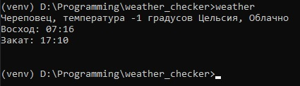

# weather_checker
It is a project where i try to get the location of the device, without gps(using ip).
After that i will get the weather on this location and show it to the user.

## Requirement api
[open_weather_api](https://openweathermap.org/)
[ipinfo_api](https://ipinfo.io/)
This API`s are free. Ofcourse they have business plans for them if you are going
to make over 10000000+ requests

## Description
Using *ipinfo_api* we get the coords of the city, where we are locate. Then,
we will use this coords with *openweather_api* to get the weather.

### Goals
This project was planned to get a good sense of type hinting in python.
I was inspired by this [video](https://www.youtube.com/watch?v=dKxiHlZvULQ)
